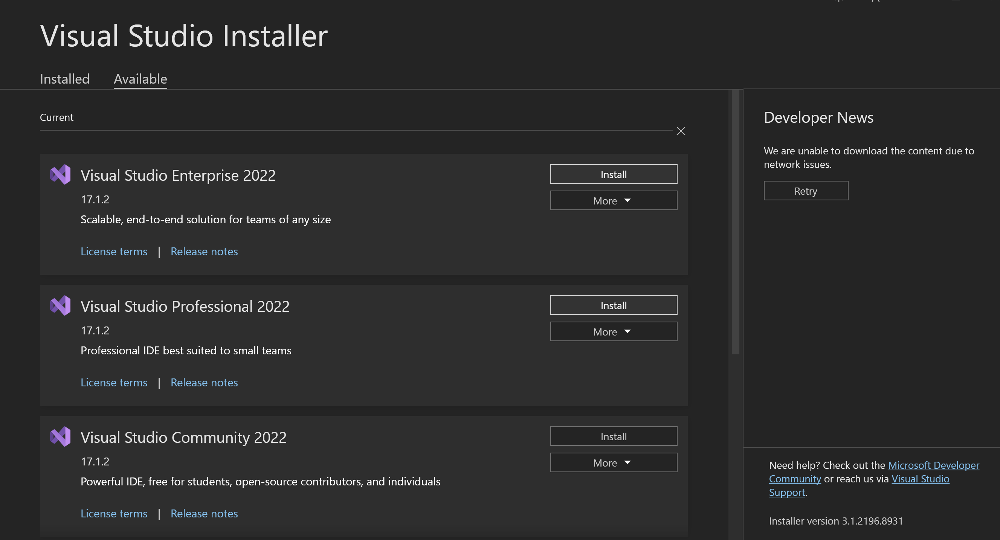
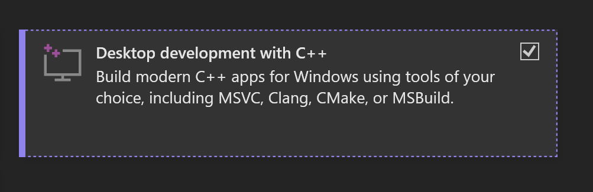
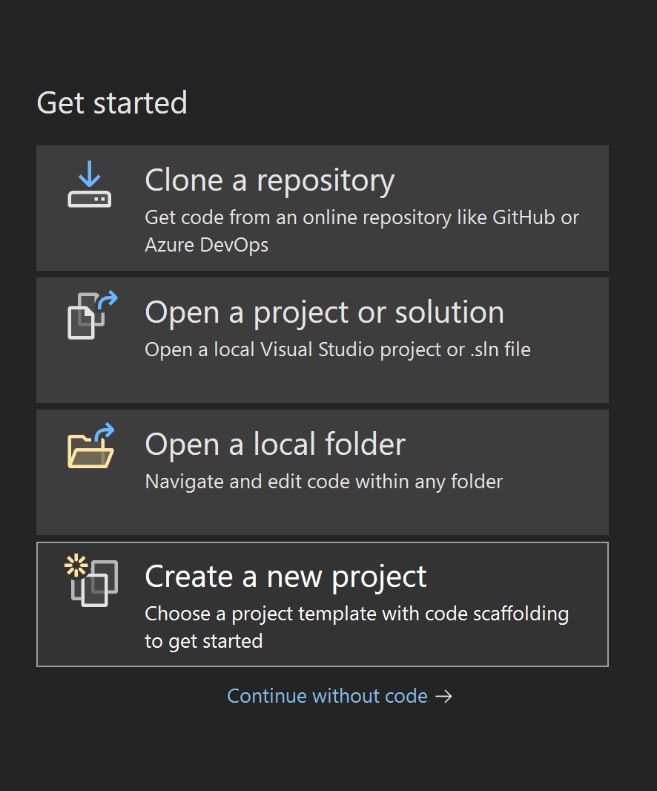
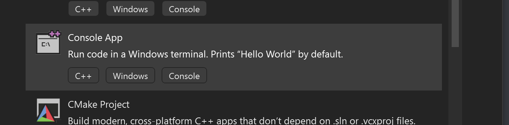
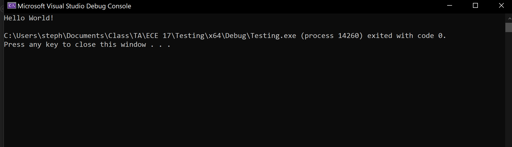

# Visual Studio Setup
 In this repo, we will be going over the steps to install **Visual Studio Professional 2022** and the Visual Studio **SonarLint** extension.

 ## Visual Studio Installation
 1. Navigate to this URL,

    https://visualstudio.microsoft.com/vs/

    and click on **Download Visual Studio**. In the corresponding dropdown, select **Professional 2022**.

    

2. You should be prompted to install the Visual Studio Installer. Follow the setup for the installer.

3. In the installer, find where Visual Studio Professional 2022 is located, most likely in the Available tab,

    

    and click on the **install** button for Visual Studio Professional 2022. 
    
    When the options for what to install in addition with Visual Studio appear,
    click on **Desktop Development With C++**.

    

4. With Visual Studio Professional 2022 Installed, launch it. You will be prompted to with several options. Choose to **Create a New Project**.

    

    Afterwards, you'll be prompted for what type of program you would like to create. Choose to create a **Console App** program.

    

5. Your project should then open up a "Hello World" program. 

    In the middle of the toolbar you will see two play buttons.

     
    
    The left one named "Local Windows Debugger" is your debugging tool. *We will go over this functionality in discussion*.

    The right one is your simple Run tool with no debugging.

    If you click the Run tool on the right, a console window will open and it should look as follows.

    

6. If all runs without error, that means that your Visual Studio is set up correctly and is ready for C++ development. 

    Now we will install **SonarLint** which is a tool used to detect bugs early, help with code quality, and detect code smells. 

## Github Installation

You will also need to install Github. Follow these instructions to install Github

https://github.com/git-guides/install-git

I recommend installing Github Desktop if you're not familiar with github command-line.

There is also an installation guide [Github Desktop](../GitSetup/github_desktop_setup.md) and [Git CLI](../GitSetup/git_cli.md)